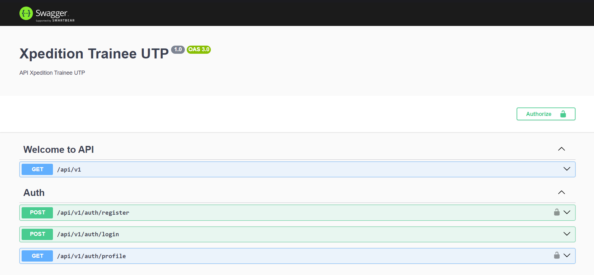

# API Xpedition Trainee UTP

## Requisitos

- Node.js >= 20.x
- PostgreSQL >= 16.x

## Tecnologías

- [NestJS](https://nestjs.com) (Node.js Framework)
- [Drizzle ORM](https://orm.drizzle.team) (ORM)
- [Swagger](https://swagger.io) (Documentación de la API)
- [JWT](https://jwt.io) (Autenticación)
- [PostgreSQL](https://www.postgresql.org) (Base de Datos)
- [Bruno](https://www.usebruno.com) (Herramienta para probar API's)

## Pasos de Configuración

1. Copia el archivo `.env.example` a `.env` y rellena todas las variables de entorno necesarias.

   ```bash
   cp .env.example .env

    # Rellena las variables de entorno
   ```

   ```env
    PORT=4000

    DATABASE_USER="postgres"
    DATABASE_PASSWORD="postgres"
    DATABASE_HOST="localhost"
    DATABASE_PORT=5432
    DATABASE_NAME="db_nest_app"
    DATABASE_SSL=false

    JWT_SECRET="PALABRA_SECRETA"
   ```

2. Instala las dependencias del proyecto.

   ```bash
    npm install
   ```

3. Crea las migraciones de la base de datos.

   ```bash
    npm run db:generate
   ```

4. Ejecuta las migraciones de la base de datos.

   ```bash
    npm run db:migrate
   ```

5. Ejecuta el seeder de la base de datos.

   ```bash
    npm run db:seed
   ```

6. Inicia el servidor de desarrollo.

   ```bash
    npm run start:dev
   ```

7. Abre tu navegador y navega a `http://localhost:4000/api/v1/`.

8. La documentación de la API estará disponible en `http://localhost:4000/api/v1/docs`.

9. La Colección de API's estará disponible en la carpeta `API - Xpedition Trainee UTP` en la raíz del proyecto.
   Se recomienda importar la colección en [bruno](https://www.usebruno.com) para probar las API's.

## Documentación

La documentación estará disponible en la carpeta `DOCUMENTOS` en la raíz del proyecto. El cual está estructurado de la siguiente manera:

- `CASOS DE USO`
- `DIAGRAMA DE PROCESOS`
- `DIAGRAMA DE ENTIDAD RELACIÓN`
- `DICCIONARIO DE DATOS`

## Captura de Pantalla


